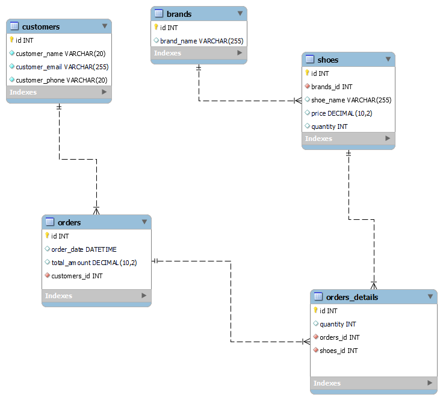

## Скриншоты 

##  5 типовых запросов к БД

1.Получить список всех брендов обуви:
```Mysql
SELECT * FROM brands;
```
2. Получить сумму всех заказов за определенный период времени  с 2024-04-15 по 2024-09-16:
```Mysql
SELECT SUM(total_amount) 
AS total_sales 
FROM orders 
WHERE order_date 
BETWEEN '2024-04-15' 
AND '2024-09-16';
```

3.Получить список наиболее популярных моделей обуви:
```Mysql
SELECT shoes.shoe_name, SUM(orders_details.quantity) AS total_quantity 
FROM shoes 
JOIN orders_details ON shoes.id = orders_details.shoes_id 
GROUP BY shoes.shoe_name 
ORDER BY total_quantity DESC 
LIMIT 3;
```

4. Получить список всех заказов, сделанных клиентом по имени:
```Mysql
SELECT * FROM orders
WHERE customers_id = (SELECT id FROM customers WHERE customer_name = 'Иван Иванов');
```

5.Получить среднюю сумму заказа:
```Mysql
SELECT AVG(total_amount) AS avg_order_amount
FROM orders;
```
##  Отдельные роли к БД:
Роль админа:
```Mysql
CREATE USER 'admin'@'%' IDENTIFIED BY 'PaSsWoRd';
GRANT ALL PRIVILEGES ON *.* TO 'admin'@'%' WITH GRANT OPTION;
FLUSH PRIVILEGES;
```

Роль покупателя:
```Mysql
CREATE USER 'customer'@'localhost';
GRANT SELECT ON sport_shoes_shop.brands TO 'customer'@'localhost';
GRANT SELECT ON sport_shoes_shop.customers TO 'customer'@'localhost';
GRANT SELECT ON sport_shoes_shop.orders TO 'customer'@'localhost';
GRANT SELECT ON sport_shoes_shop.orders_details TO 'customer'@'localhost';
GRANT SELECT ON sport_shoes_shop.shoes TO 'customer'@'localhost';
FLUSH PRIVILEGES;
```

Роль менеджера:
```Mysql
CREATE USER 'manager'@'localhost';
GRANT SELECT, INSERT, UPDATE, DELETE ON sport_shoes_shop.* TO 'manager'@'localhost';
FLUSH PRIVILEGES;
```
